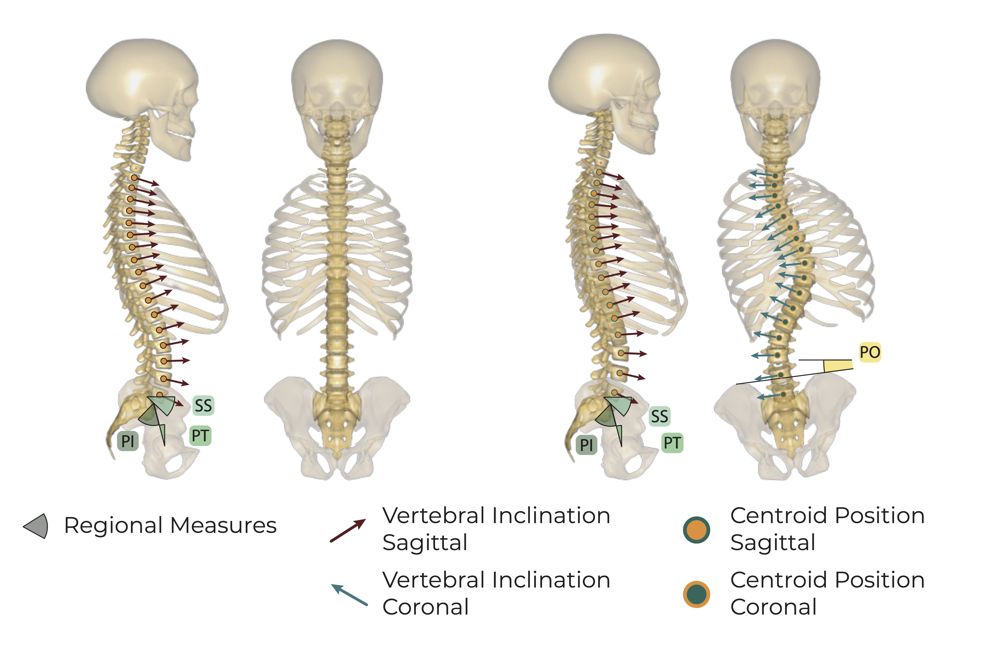
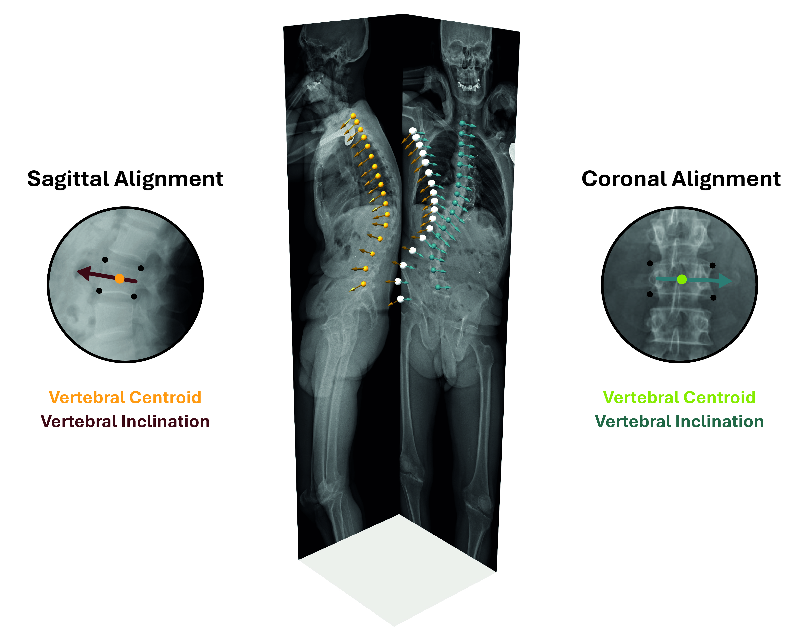

<div align="center">
  <h1>Biplanar Spinal Alignment Reconstruction Method</h1>
  <p>
    AnyBody plugin for high fidelity reconstructing of 3D spinal alignment from biplanar radiographs.
    <br />
    <!-- Optional: link to preprint/paper -->
    <a href="https://doi.org/XX.XXXX/your-doi-here"><strong>Caimi et Rieger et al. (202X)</strong></a>
  </p>
</div>


<p align="center">
  
</p>


---

## Table of Contents

- [About](#about)
- [Features](#features)
- [Methods Overview](#methods-overview)
- [Installation](#installation)
- [Usage](#usage)
- [Repository Structure](#repository-structure)
- [Input Data](#input-data)
- [Outputs](#outputs)
- [Validation & Limitations](#validation--limitations)
- [How to Cite](#how-to-cite)
- [Contributions](#contributions)
- [Contact](#contact)

---

## About

This repository provides an AnyBody-based implementation of a spinal alignment reconstruction method. Using vertebral landmark annotations extracted from single- or biplanar radiographs, the model reconstructs the 3D spinal alignment, including vertebral centroid positions and segmental orientations.

The implementation provides an improved posture-reconstruction approach for researchers evaluating spine biomechanics through Musculoskeletal Modeling (MSK) based on single- or biplanar radiographs. It serves as a supplementary module to the AnyBody Modeling System and enables users to:
- Calibrate 3D spinal alignment models in AnyBody from sagittal or coronal radiographic projections
- Integrate subject-specific spinal alignments into downstream musculoskeletal simulations

<p align="center">
  
</p>

---

## Features

- AnyBody Modeling System implementation (version 8.0+)
- Biplanar (coronal + sagittal) landmark-based posture reconstruction
- Automatic computation of global and segmental alignment parameters
- Example datasets and scripts for running the full pipeline

---

## Methods Overview

High-level pipeline:

1. **Input**: Extracted landmarks of biplanar radiographs in sagittal and (optionally) coronal planes  
2. **Landmark definition**: 2D coordinates of vertebral corner nodes and spinopelvic parameters Pelvic Incidence (PI), Pelvic Tilt (PT), Sacral Slope (SS) and Pelvic Obliquity (PO)
3. **Inputs**: Vertebral inclinations in the sagittal and coronal plane and vertebral centroids coordinates
4. **3D reconstruction**: Posture reconstruction drivers that integrate the degrees of freedom in the model setup
5. **Alignment metrics**: Computation of sagittal and coronal angles, offsets, and global alignment parameters  

---

## Installation

### Requirements

- **AnyBody Modeling System** version 8.0 or higher

### Get the repository

```bash
git clone https://github.com/USERNAME/biplanar-spinal-alignment.git
cd biplanar-spinal-alignment
```

--- 

## Usage

---

## Installation

---

## Repository structure 

```
biplanar-spinal-alignment/
├─ Application/
│  ├─ Main.any             # Entry point for the AnyBody model
├─ Model/
│  ├─ Segments/            # Vertebra/pelvis segment definitions
│  ├─ Drivers/             # Kinematic drivers for the reconstruction
│  └─ Measures/            # Alignment measures, output measures
├─ Input/
│  ├─ landmarks/           # Example 2D landmark CSV files
│  └─ config/              # Subject-specific parameter files
├─ Scripts/
├─ docs/
│  ├─ images/             
│  └─ input
├─ tests/                  # (Optional) regression tests or small checks
├─ LICENSE
└─ README.md
```

---

## Input Data

A complete example input file is provided here:

[docs/input/example_input_file.any](docs/input/example_input_file.any)


---

## Outputs 

---

## Validation & Limitations

---

## How to cite

todo

---

## Contributions

Special thanks to all co-authors for their contributions, as well as the European Spine Study Group (ESSG) for constantly collecting clinically relevant data.

---

## Contact 

For questions about the method or collaborations, please contact:  
  
Alice Caimi  
ETH Zurich  
Institute for Biomechanics  
GLC H23. 
Gloriastrasse 37 / 39. 
8092 Zurich, Switzerland  
alice.caimi@hest.ethz.ch  

Florian Rieger  
ETH Zurich  
Institute for Biomechanics  
GLC H23. 
Gloriastrasse 37 / 39. 
8092 Zurich, Switzerland  
florian.rieger@hest.ethz.ch  
